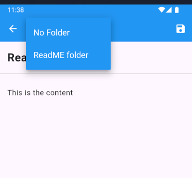

# BrainWave

## Table of Contents
- [Introduction](#introduction)
- [Features](#features)
  - [Notes](#notes)
  - [Folders](#folders)
  - [Reminders](#reminders)
  - [AI Features](#ai-features)
  - [Search](#search)
- [Getting Started](#getting-started)
  - [Installation](#installation)
  - [Login Page](#login-page)
  - [Sign Up](#sign-up)
- [Usage](#usage)
  - [Creating a Note](#creating-a-note)
  - [Editing a Note](#editing-a-note)
  - [Managing Folders](#managing-folders)
  - [Setting Reminders](#setting-reminders)
- [Deleting Content](#deleting-content)
  - [Deleting Notes](#deleting-notes)
  - [Deleting Folders](#deleting-folders)
- [Screenshots](#screenshots)
  - [Authentication](#authentication)
    - [Login Page](#login-page)
    - [Sign Up](#sign-up)
    - [Sign In](#sign-in)
  - [Notes](#notes-1)
    - [Creating a Note](#creating-a-note-1)
    - [Editing a Note](#editing-a-note-1)
    - [Empty Note](#empty-note)
  - [Folders](#folders-1)
    - [Managing Folders](#managing-folders-1)
    - [Folder Features](#folder-features)
    - [Folder Picker](#folder-picker)
    - [One Folder View](#one-folder-view)
  - [Reminders](#reminders-1)
    - [Setting Reminders](#setting-reminders-1)
    - [Delete Reminder](#delete-reminder)
  - [AI Features](#ai-features-1)
  - [Search](#search-1)
  - [Empty States](#empty-states)
- [License](#license)

## Introduction
BrainWave is a versatile note-taking application designed to help you organize your thoughts, tasks, and reminders efficiently. With features like folders and reminders, managing your notes has never been easier.

## Features

### Notes
- Create, edit, and save notes.
- Add titles and detailed content.
- Easily access and modify your notes.

### Folders
- Organize notes into customizable folders.
- Create new folders from the sidebar.
- Rename or delete folders as needed.
- Move notes between folders using a dropdown selection.

### Reminders
- Set reminders for important notes.
- Pick specific dates and times for reminders.
- Visual indicators for notes with active reminders.

### AI Features
- Summarize your note and get answers to questions you might have in the note
- Use suggestions to get ideas for topics your note discusses

### Search
- Search for notes within a folder using the search bar.
- Quickly find notes by entering keywords.
- A logout icon is available beside the search bar for easy logout.

## Getting Started

### Installation

To install and run the application, follow these steps:

1. **Clone the repository:**
   ```sh
   git clone https://github.com/HarshPanchal01/BrainWave.git
   cd brainwave
2. **Run the application:**
    ```sh
    cd src
    flutter clean && flutter pub get # Install dependencies
    flutter run
> **Note:** You must have flutter installed to run the application, follow this documentation if needed: https://docs.flutter.dev/get-started/install

### Login Page
On the login page, you can enter your email and password if you already have an account. If you incorrectly type your password, an error message will appear in the snackbar indicating that the password is incorrect. However, if you enter your email and password correctly, you will be navigated to the home page.

### Sign Up
If you don't have an account, you can tap the sign-up link on the login page to navigate to the sign-up page. Here, you can create an account by providing your first name, last name, email, password, and confirming your password. Ensure that both passwords match before creating an account; otherwise, an error message will appear in the snackbar indicating that the passwords do not match. Additionally, if you try to create an account with an email that is already in use, an error message will appear in the snackbar indicating that the email is already in use.

## Usage

### Creating a Note
1. Tap on the **`+`** button to create a new note.
2. Enter the **title** and **content** for your note.
3. Tap **Save** to add the note to your list.

### Editing a Note
1. Tap on an existing note to open it.
2. Make the desired changes to the title or content.
3. Tap **Save** to update the note, or tap **Back** to discard changes.

### Managing Folders
1. Open the sidebar by tapping the icon on the top left.
2. Create a new folder by selecting the **Create Folder** option.
3. Notes created without specifying a folder will be placed in the default **Notes** folder, which cannot be deleted.
4. To rename or delete a folder, tap on the **`⋮`** (three dots) beside the folder name.

### Setting Reminders
1. To add a reminder to a note, tap on the **bell** icon.
2. Pick the desired **date and time** for the reminder.
3. The bell icon will turn **blue** to indicate an active reminder.

## Deleting Content

### Deleting Notes
1. Tap on the **trash** icon associated with the note you wish to delete.
2. Confirm the deletion when prompted.

### Deleting Folders
1. Tap on the **`⋮`** (three dots) next to the folder you want to delete.
2. Select the **Delete** option and confirm.
   > **Note:** Deleting a folder will also remove all notes contained within it.

## Screenshots

### Authentication

#### Login Page


#### Sign Up


### Notes

#### Creating a Note


#### Editing a Note


### Folders

#### Managing Folders


#### Folder Features


#### Folder Picker


### Reminders

#### Setting Reminders


#### Delete Reminder


### AI Features


### Search


### Empty States

#### Empty Screen


#### Empty Folders


## License
This project is licensed under the [MIT License](LICENSE).